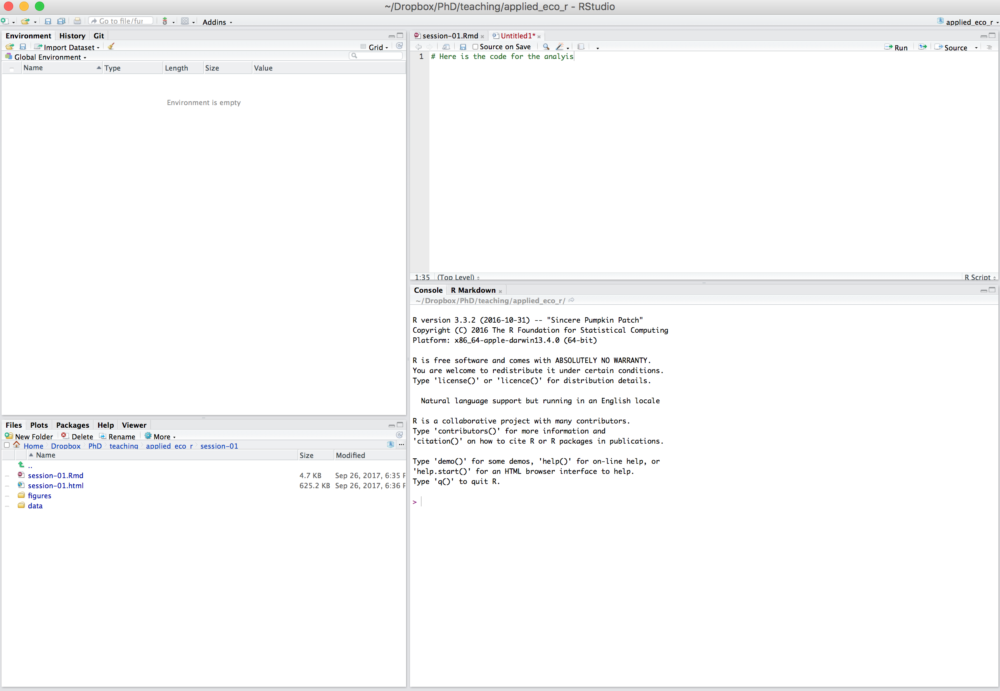
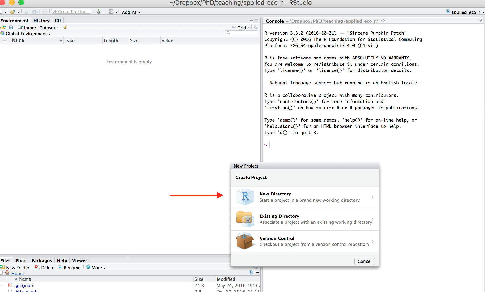
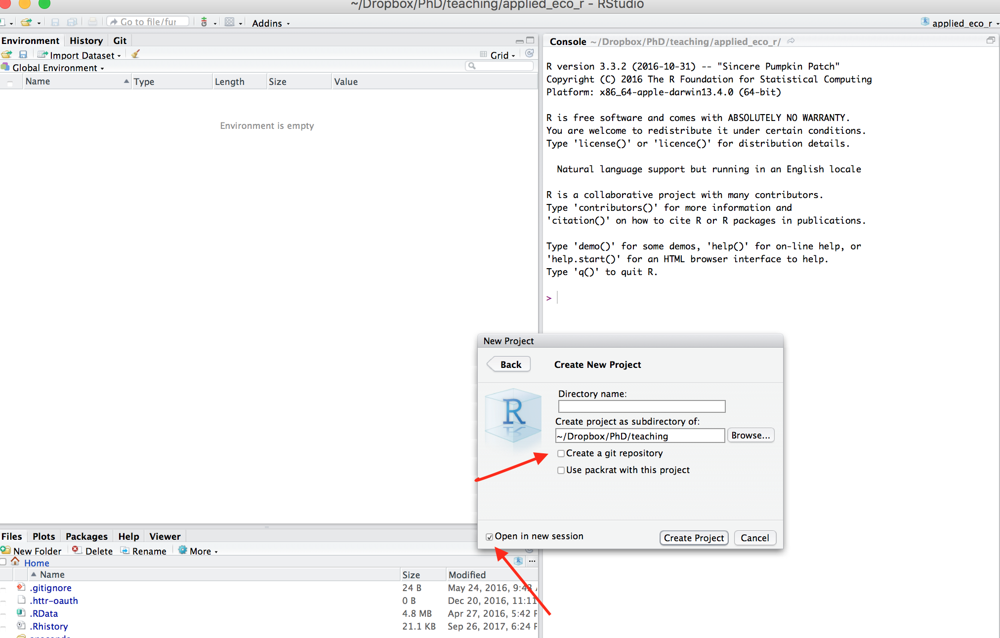
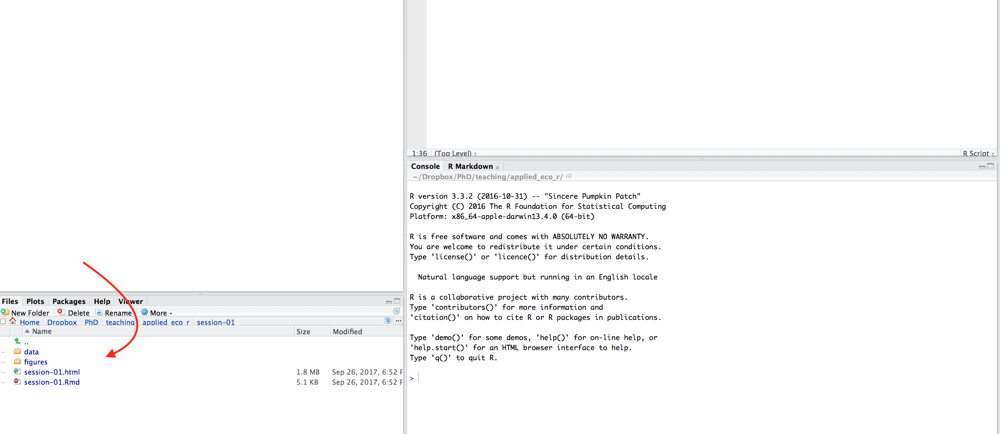

## 1. Introduction... R in a nutshell 

- What is [R](https://www.r-project.org)?   _programming language_, _environment_, _software_...

    - Object programming 
    - Open source and free
    - Compatibility with other languages i.e., Phyton, Javascript
    - Important learning curve 
    - Documentation far from perfect but getting into shape.
      
    
- What is [RStudio](https://www.rstudio.com)? Integrated Development Environment that makes R programming more user friendly. 

- What can you do with R?

    - Data analysis
    - Data manipulation
    - Data visualisation
    - Dynamic documents 
    - Websites 
      - .... possibly more things that I don´t know

## 2. Is R a good investment?


Source: "The popularity of Data Analysis software (Muenchen (2016) "(www.r4stats.com)


## 3. How do we structure a data analysis project?

- Steps in a data analysis project 


Source: _R for Data Science_ (Wickham and Grolemund (2016))


## 4. Let´s get our head around...





## Create a project

Projects enable a better organization of the files and keeps a better control of the workflow (e.g. scripts, data, final documents, etc...) and also improve the efficiency of the workflow. 

- **Project - New Project - New Directory -  Empty project - (select directory...)**
    
    
    
    
    
- **Locate** somewhere in your computer
   
   


   
   
  
  
- _Optional_ (although highly recomended): Create a control version of the project 

    - It enhances reproducibility and collaboration
    - Keeps record and reduces errors 
    - Limits software dependency
    - Back up big data prokect

## Organise a project 

   


    

**Step 2: Resources**

- In case of doubt there are different ways to proceed: 


     + Specialised websites - e.g. [stackoverflow.com](http://stackoverflow.com/questions/tagged/r)
     + [R Mailing lists](https://www.r-project.org/mail.html)
     + `help`, `help.search()`, `??(name package/name function)`
     + Google your query


## 5. Data structures 

- In R every element is regarded as an object. Objects are data structures that group data according to specific attributes. Most general data structures are organised by two elements

    - Dimensionality 
    - Type of the contents (homogeneous, heterogeneous)
    
      1. **`numeric or character`**: single number of letter
      
      2. **`Vector`**: 1 dimension, homogeneous objects.
      
      3. **`List`**: 1 dimension, heterogenous objects - (different objects grouped together)
      
      3. **`Matrix`**: more than 1 dimension, homogenous objects 
      
      4. **`Data frame`**: more than 1 dimension, heterogenous objects. 
      
  

## 6. Data structures: examples 


* This is a `vector`
```{r, echo = FALSE, include = TRUE}

v =c(1,2,3,4)
v
```

* This is a `list`
```{r, echo = FALSE, include = TRUE}

l = list(c(1:5), c(1:2))
l
```

This is a `data.frame`
```{r, echo = FALSE, include = TRUE}
df = data.frame(numbers = c(1,2), letters = c("a", "b") )
df
```

* Data.frames are the most common data structure for gathering information.

    - **Variables**: Collect different arguments associated with the information to be analysed - diffrent formats (numbers, strings, factors, dates, ...)
    - **Observations**: Units of analysis (individuals, firms, etc...) - e.g. the rows of your dataset.
    

## 7. Inputting information 

-  There are two possible ways to input information: 

     - **Manually**
     
     - **Import from somewhere**

- The majority of the analyses import data 

    - Data are delivered in different formats
    - Important to understand how information is structured 
            
**Step 1: Get started**

- The first commands consist of the following instructions: 

```{r, echo = TRUE, eval = FALSE}

# working directory
setwd("/Users/Personas/My Cloud/PhD _october_2016/teaching/R tutorial") 

#install.packages() # for installing packages 
#library("") # for loading libraries

```

